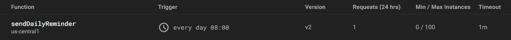

# SMS-Assignment-Reminder

I sometimes forget to check Canvas for my assignments, but I always check my texts. This program uses the Canvas API to retrieve my upcoming assignment deadlines. It then sends an SMS message using the Twilio API. Firebase functions is used for scheduling to ensure that I am reminded of upcoming deadlines every morning at 8 am. Program built with Node.js and written in JavaScript.

Canvas API:
url:GET|/api/v1/courses - Returns a list of my courses which I used to map course id's to course names
url:GET|/api/v1/users/self/todo - Returns a list of my todo items which I sort by date

Twilio API:
The create method is used to send a new SMS text message containing my todo items
I use the lowest tier of Twilio which means I can only send messages to a limted number of phone numbers
client.messages.create({
body: message,
from: TWILIO_PHONE,
to: USER_PHONE,
});

Firebase Functions:

